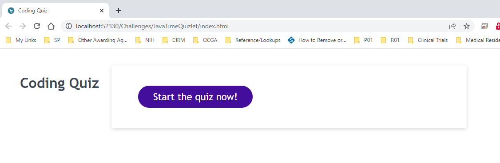
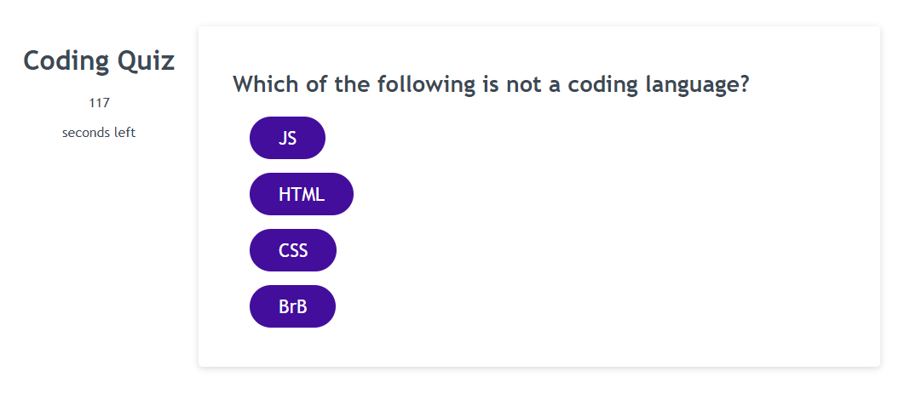
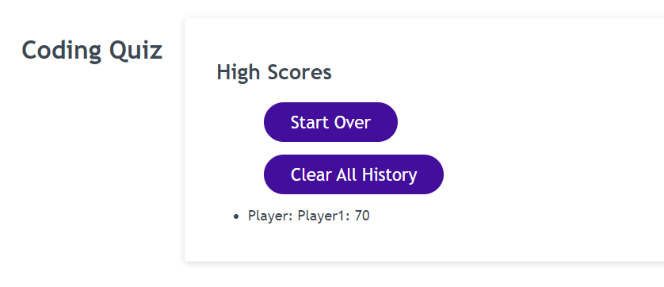

# JavaTime Quizlet

  ## Table of Contents
  1. [Project Description](#project-description)
  2. [Installation Instructions](#installation-instructions)
  3. [How To Use](#how-to-use)
  4. [How To Contribute](#how-to-contribute)
  5. [Contact Me](#contact-me)

  ## Project Description
  * This is a short quiz on coding fundamentals. Try to get the high score!

  ## Installation Instructions
  * This quizlet is available at https://kabdomora.github.io/JavaTimeQuizlet/

  ## How To Use
  * Compete against friends, or yourself! See how high of a score you can get!

  ## How To Contribute
  * To contribute, contact me on GitHub!

  Deployed link: https://kabdomora.github.io/JavaTimeQuizlet/
  Deployed screenshot: 
  Deployed screenshot: 
  Deployed screenshot: 
  

  ## Contact Me
  * Find me on Github: [kabdomora](http://github.com/kabdomora)
  * For additional feedback, email me at [kaylabrown@mednet.ucla.edu](mailto:kaylabrown@mednet.ucla.edu)
